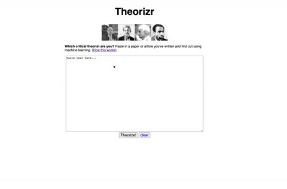

# theory-classifier
a web app that uses sklearn's text classification models to compare your writing to that of critical theorists, telling you who you sound like.

See it in action at [skshvl.pythonanywhere.com]() (as of 29 Dec, 2020)

The code assumes a folder called theory-texts/ which contains folders of .txt files. Each folder's name is a given theorist's name, and the .txt files are their works.

You can continue without adding new training data. In that case, the app will continue with the existing training data and build a classifier based on that.

**In either case, to run the model you have to first run model_builder.py, which will load the training data and fit the classifier.**

